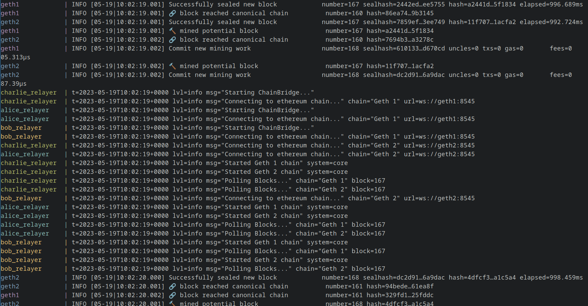

# evm-chainbridge-evm
Running Chainbridge between two geth network with 3 relayers
## Prerequisites
- Docker, docker-compose
- [cb-sol-cli](https://github.com/ChainSafe/chainbridge-deploy/tree/master/cb-sol-cli#cb-sol-cli-documentation)

## Get started
Start both chains, setup on-chain & run those 3 relayers
```bash
docker compose up -V
```
wait until the setup is completed, and relayers is up as shown below:


test the bridge with bash script
```bash
./test_bridge.sh
```
**NOTE**: need to change NFT_ID in `.env` to unique number in hex format if run `./test_bridge` again and again
